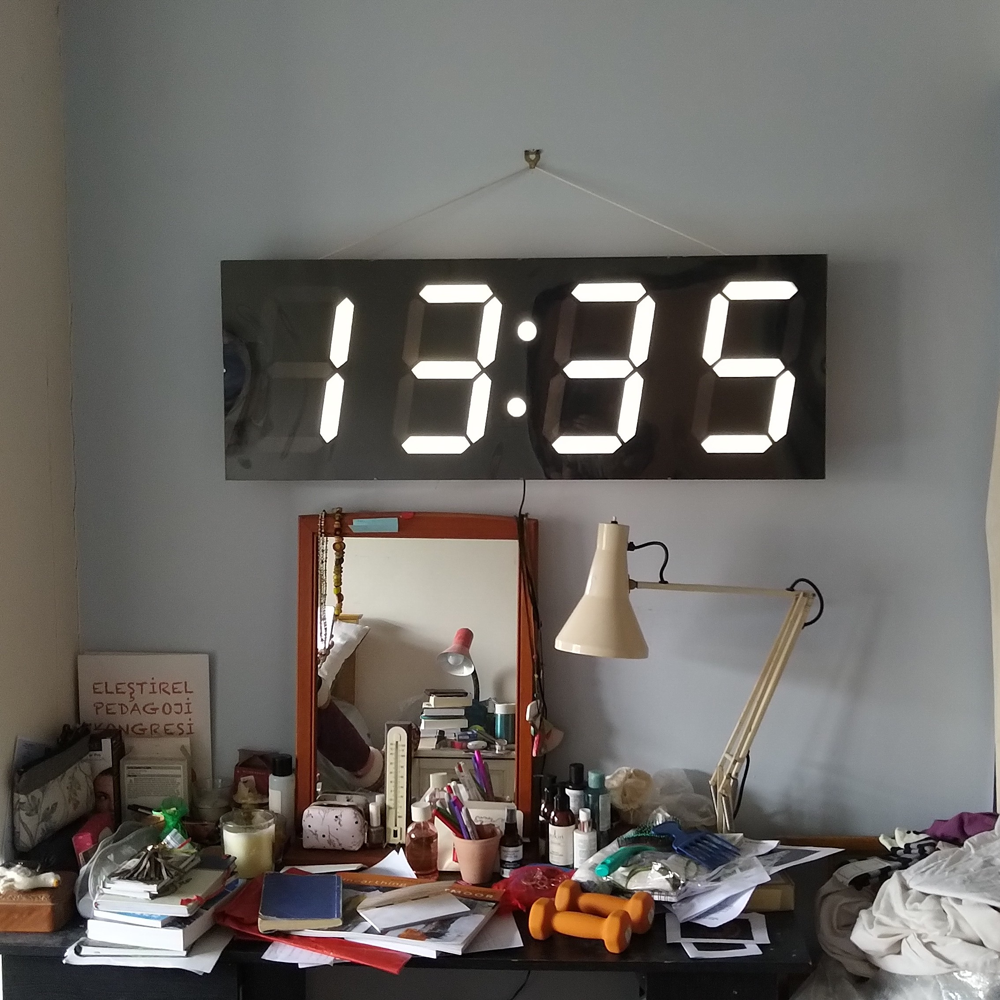
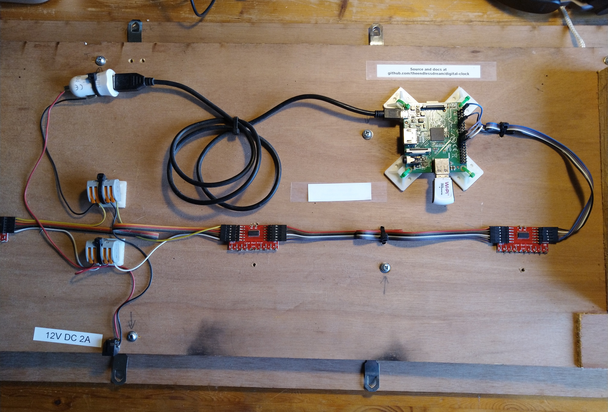

# digital-clock

## Hardware Components

Raspberry Pi 1 A+, with micro SD card.

Wifi USB dongle.

4x Large digit display drivers https://www.sparkfun.com/sparkfun-large-digit-driver.html
These are _TPIC6C596 Power Logic 8-Bit Shift Registers_ on a castellated PCB. Cheap alternatives to the Sparkfun ones can be
found at the usual online retailers.

12 V to 5 V converter (Car cigarette socket USB charger)

Just under 3 m of 12 V LED strip cut into 10 cm lengths.

12 V, 2 A power supply

## Wiring

The display drivers are daisy-chained together using the IN and OUT connections.

From the 12 V power supply, 12 V and GND go to the display drivers. I chose to wire this into the middle of 
the daisy chain.

Each display driver has castellated connections on the long edge to go to the segments of the digit. They share a common positive 
connection to 12 V, the negative connections for each segment of the digit, and the decimal point, which is used for the
flashing colon on the clock.

From the Raspberry Pi 40 pin header to the first display driver (for the 10s of hours):

| Raspberry Pi (Pin) | Display Driver IN | 
|--------------------|-------------------|
| Ground (25)        | GND               |
| SPI0 CE0 (24)      | LAT               |
| SPI0 SCLK (23)     | CLK               |
| SPI0 MOSI (19)     | SER               |
| 5V power (2)       | 5V                |

## Software

Install Raspberry Pi OS Lite as the operating system.

Set up WiFi connection.

In the Raspberry PI, enable SPI. Use `sudo raspi-config`.

Copy `clock.py` to somewhere e.g. your home directory. Check it works by running `python clock.py`.

### Automatic start on boot

To make it automatically start on boot, copy `clock.service` to the `/etc/systemd/service` directory.

Enable the service with `sudo systemctl enable clock.service`.